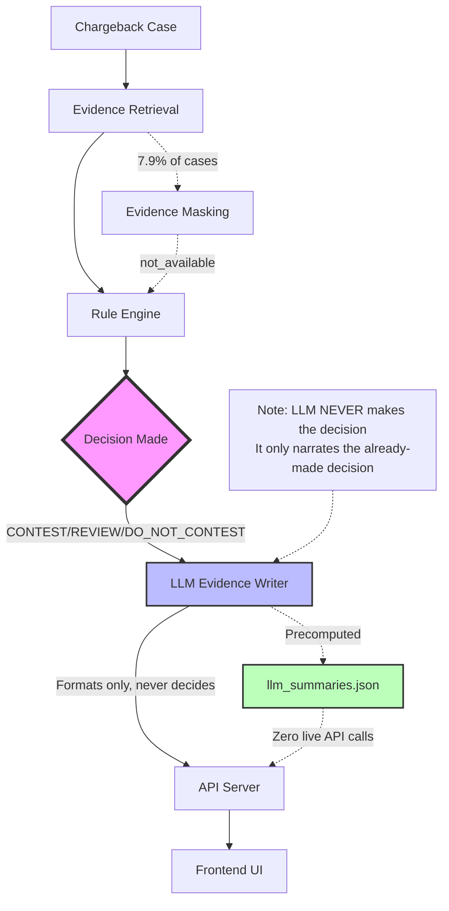

# DisputeLens - System Architecture

## High-Level Flow



## Detailed Component Flow

### 1. Evidence Retrieval (`pipeline/retrieval.py`)
**Input**: Chargeback ID  
**Process**:
- Joins 6 tables: chargebacks, transactions, orders, fulfillment, customers, communications
- Deterministic masking (7.9% of cases): Randomly mark ONE field as `not_available`
  - Maskable fields: `delivery_confirmed`, `signature_captured`, `has_unresolved_complaint`, `refund_issued`
  - Simulates: Webhook failures, delayed reconciliation, integration gaps
- Removes ground truth labels before passing to rule engine

**Output**: Evidence dictionary

### 2. Rule Engine (`pipeline/rules.py`)
**Input**: Evidence dictionary  
**Process**:
- Applies 9 weighted rules:
  - Positive: +30 payment, +25 delivery, +15 signature, +10 no_refund, +10 no_complaint, +10 good_customer
  - Negative: -20 repeat_disputer, -30 delivery_not_confirmed, -25 refund_issued
- **Key**: Fields marked `not_available` contribute **0** (not False)
  - `delivery_confirmed = false` → -30 penalty
  - `delivery_confirmed = not_available` → 0 (unknown, no penalty)
- Computes total score

**Thresholds**:
- **CONTEST**: score ≥ 85
- **REVIEW**: 45 ≤ score < 85
- **DO_NOT_CONTEST**: score < 45

**Output**: Decision, score, fired rules list

### 3. Policy Gate (Implicit)
**Concept**: The rule engine IS the policy gate. Decision is made here, not by LLM.

### 4. LLM Evidence Writer (`pipeline/evidence_writer.py`)
**Input**: Evidence + **already-made decision** + score + fired rules  
**Process**:
- Calls Google Gemini API (gemini-3.5-flash-lite)
- Generates 3-6 sentence summary
- Formats evidence as claims → source → value
- Lists gaps explicitly (fields marked `not_available`)
- Restates recommendation **exactly as given**

**Critical**: LLM **cannot** alter decision, infer missing facts, or change confidence levels

**Output**: JSON with summary, evidence list, gaps, recommendation, confidence

### 5. Precomputation (`precompute_summaries.py`)
**Purpose**: Generate all 700 dev case summaries once, store in JSON  
**Benefit**: Zero live Gemini API calls during browsing/demo

**Process**:
- Run all 700 cases through retrieval → rules → LLM
- Store results in `data/dev/llm_summaries.json`
- API loads this file at startup

### 6. API Server (`api/main.py`)
**Framework**: FastAPI  
**Endpoints**:
- `GET /` - Health check
- `GET /chargebacks` - List all cases
- `GET /chargebacks/{id}` - Full case detail (retrieval + rules + precomputed LLM summary)
- `GET /metrics` - Performance metrics

**Key**: Serves precomputed summaries from JSON, no live LLM calls

### 7. Frontend (`frontend/`)
**Framework**: React + Vite  
**Views**:
- **Case List**: Sortable table, filter by gaps
- **Case Detail**: Staggered evidence reveal, LLM summary, confidence gauge, debug mode
- **Metrics**: Confusion matrix, precision/recall, cost analysis, masking impact

---

## Decision Flow Diagram

```
Chargeback Case
       ↓
[Evidence Retrieval]
       ↓
  Evidence Dictionary
       ↓
[Rule Engine] ←─────── DECISION MADE HERE
       ↓
  CONTEST / REVIEW / DO_NOT_CONTEST
       ↓
[LLM Evidence Writer] ←─── NARRATION ONLY (never changes decision)
       ↓
  Formatted Summary
       ↓
[API Server] ←─────── Serves precomputed summaries
       ↓
[Frontend UI]
       ↓
  User sees: Evidence + Decision + LLM Summary
```

---

## Key Architectural Principles

### 1. LLM Never Makes Decisions
- Rule engine makes decision FIRST
- LLM only formats/narrates AFTER decision is final
- LLM cannot alter decision, confidence, or recommendations
- Prevents hallucination risk in decision logic

### 2. Deterministic Core
- Evidence retrieval: Deterministic (seeded masking)
- Rule engine: Fully deterministic (no randomness)
- Decision thresholds: Fixed (45, 85)
- Only LLM summary text is non-deterministic (but decision is fixed)

### 3. Missing Evidence Handling
- `not_available` ≠ `false`
- Missing fields contribute 0 to score, not negative
- Reduces score → pushes toward REVIEW → conservative

### 4. Zero Live API Calls (Production)
- All summaries precomputed for dev set
- API loads from static JSON file
- No rate limit risk, no latency
- Offline demo capability

---

## Data Flow

```
CSV Files (6 tables)
       ↓
[EvidenceRetriever.retrieve_all()]
       ↓
List of Evidence Dicts
       ↓
[DefensibilityRuleEngine.score(case)]
       ↓
(decision, score, fired_rules)
       ↓
[EvidenceWriter.write_summary(case, decision, score, rules)]
       ↓
LLM Summary JSON
       ↓
[Saved to llm_summaries.json]
       ↓
[API loads at startup]
       ↓
[Frontend fetches via REST]
       ↓
User Interface
```

---

## Technology Stack

**Backend**:
- Python 3.9+
- FastAPI (REST API)
- Pandas (data processing)
- Google Gemini API (gemini-3.5-flash-lite)
- python-dotenv (config)

**Frontend**:
- React 18
- Vite (build tool)
- React Router (routing)
- CSS3 (dark theme, animations)

**Data**:
- CSV files (chargebacks, transactions, orders, fulfillment, customers, communications)
- JSON (precomputed LLM summaries)

---

## File Structure

```
DisputeLens/
├── api/
│   └── main.py                   # FastAPI server
├── frontend/
│   ├── src/
│   │   ├── App.jsx               # Main React app
│   │   └── components/
│   │       ├── CaseList.jsx      # Case list view
│   │       ├── CaseDetail.jsx    # Case detail with LLM summary
│   │       └── MetricsView.jsx   # Metrics dashboard
│   └── package.json
├── pipeline/
│   ├── retrieval.py              # Evidence retrieval + masking
│   ├── rules.py                  # Rule engine (9 weighted rules)
│   └── evidence_writer.py        # LLM evidence formatter
├── eval/
│   ├── run_eval.py               # Dev set evaluation
│   ├── run_heldout.py            # Heldout set evaluation (run once)
│   ├── heldout_results.json      # Heldout metrics
│   └── failure_case_demo.json    # Example conservative false negative
├── data/
│   ├── dev/
│   │   ├── *.csv                 # 700 dev cases (6 tables)
│   │   └── llm_summaries.json    # Precomputed LLM outputs (700 summaries)
│   └── heldout/
│       └── *.csv                 # 300 heldout cases (evaluated once)
├── data_gen/
│   └── generate.py               # Synthetic data generation
├── .env                          # API key (not committed)
├── requirements.txt              # Python dependencies
├── precompute_summaries.py       # Batch LLM summary generator
├── README.md                     # Main documentation
├── FINAL_EVALUATION_REPORT.md    # Detailed evaluation results
└── ARCHITECTURE.md               # This file
```

---

## Deployment Considerations

### Environment Variables
```bash
GEMINI_API_KEY=your_google_gemini_api_key
```

### Startup Sequence
1. Load `.env` file
2. Initialize Evidence Retriever (load CSV files)
3. Initialize Rule Engine (load weights/thresholds)
4. Initialize Evidence Writer (connect to Gemini API)
5. Load precomputed summaries from `llm_summaries.json`
6. Start FastAPI server
7. Serve frontend (Vite dev server or static build)

### Monitoring (Production)
- API response times (should be <50ms for precomputed summaries)
- Score distribution (watch for drift)
- Escalation rate (should stay 20-25%)
- Error rates (false positive/negative trends)
- Evidence masking rate (should match expected ~8%)

---

**Architecture Version**: 1.0  
**Last Updated**: September 4, 2026
